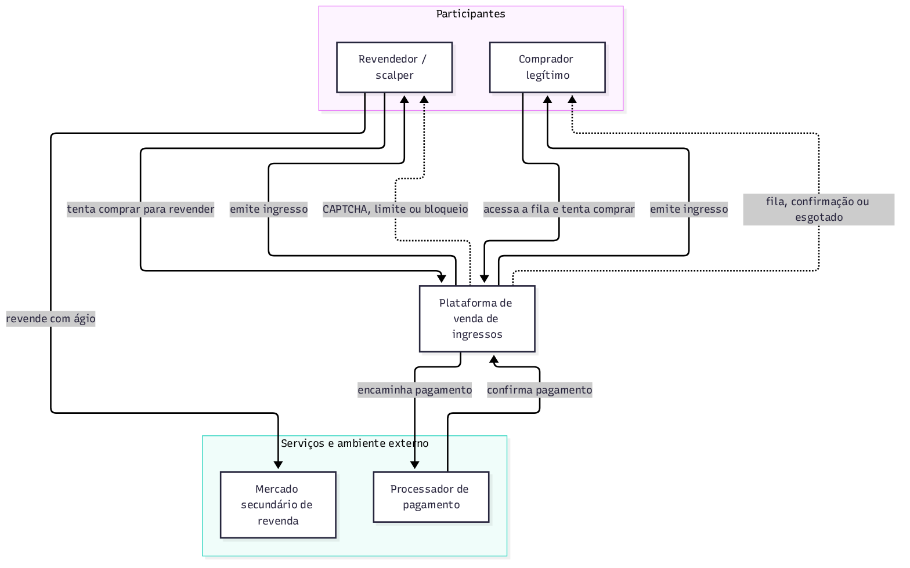
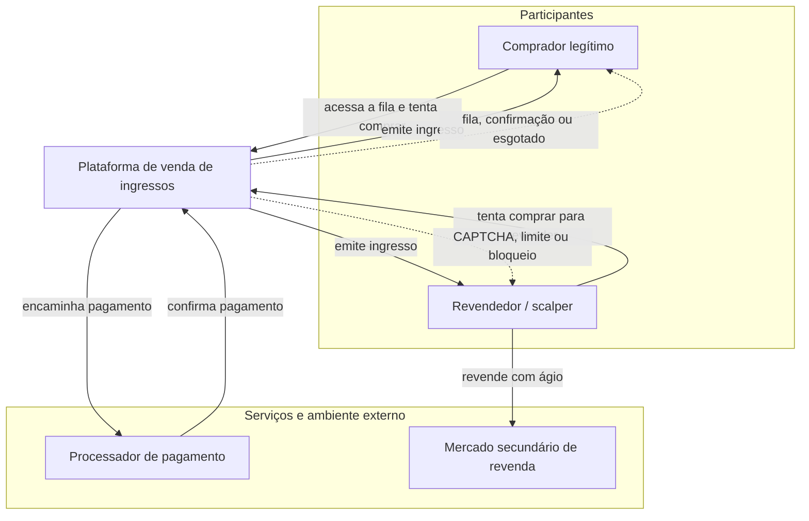
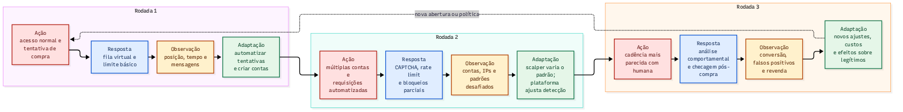
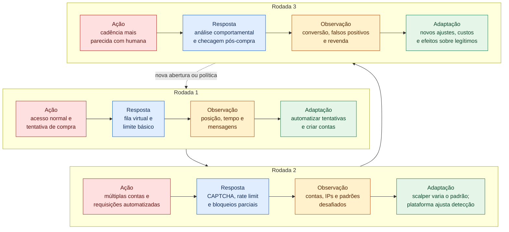
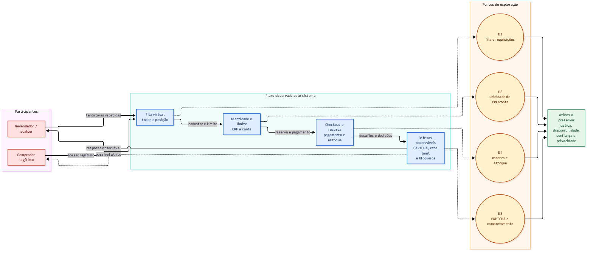

# Trabalho 1 — Análise de um Sistema Adversarial

**Sistema analisado:** Venda de ingressos para eventos com estoque limitado (fila virtual de compra)

**Grupo 1 — integrantes:** Eduardo dos Santos Paim, Felipe H. Scherer, Rafael da Silva Moral e Lucas Correa Rodrigues.

> Consulte também [`GUIA-DE-EXECUCAO.md`](GUIA-DE-EXECUCAO.md) para o checklist de fechamento e entrega.

**Natureza da análise:** modelo hipotético para planejamento e desenho arquitetural. As rodadas, capacidades e riscos abaixo são hipóteses do caso, não resultados de ataques ou medições em uma plataforma real. Não houve implementação nem testes invasivos. O uso de automação para obter recursos escassos, contornar CAPTCHA e reter estoque tem correspondência com as categorias OAT-005, OAT-009 e OAT-021 da OWASP [2]; os detalhes de CPF, fila e controles são escolhas deste modelo.

---

## 3.1 Descrição do sistema adversarial

### Sistema e interação analisada

O sistema escolhido é uma **plataforma de venda de ingressos online** (ex.: para um show com lotação limitada). A interação específica analisada é a **compra de ingressos durante a abertura das vendas gerais**, quando a demanda supera a oferta e os compradores entram em uma fila virtual até que o estoque se esgote.

Não será analisado o domínio "venda de ingressos" como um todo (emissão, reembolso, check-in no evento, etc.), apenas o recorte: **do momento em que a venda abre até o estoque se esgotar ou o comprador concluir a compra**.

**Por que este recorte atende aos critérios do enunciado (item 2):**

| Requisito | Como é atendido |
|---|---|
| Pelo menos dois participantes que tomam decisões | Comprador legítimo, revendedor/scalper (operando com bots) e a plataforma (defensor) |
| Objetivos total ou parcialmente conflitantes | Scalper quer maximizar a quantidade de ingressos adquiridos; comprador legítimo quer garantir 1 ingresso ao preço de tabela; plataforma quer distribuir de forma justa e manter disponibilidade |
| Regra, métrica ou decisão explorável | Limite de ingressos por CPF/conta e posição na fila virtual podem ser contornados com múltiplas contas/bots |
| Resposta observável que permite reação/adaptação | Mensagens de fila, CAPTCHA, bloqueio de conta/IP, esgotamento de estoque são observáveis pelos atores |
| Escopo pequeno, implementável no Trabalho 2 | É viável simular: fila de pedidos, limite por conta, emissão de CAPTCHA/rate limit e checagem de CPF duplicado, sem precisar de uma plataforma completa |

### Atores, objetivos, ações e restrições

| Ator | Objetivo | Ações ou capacidades | Informações observáveis | Restrições ou custos |
|---|---|---|---|---|
| **Comprador legítimo** | Garantir 1 (ou poucos) ingresso(s) ao preço de tabela, para uso próprio, com o mínimo de esforço/atrito | Acessar o site/app no horário de abertura; aguardar na fila virtual; resolver CAPTCHA; preencher dados de pagamento; tentar novamente em caso de falha | Sua posição na fila; mensagens de erro ou "esgotado"; se o checkout foi concluído | Tempo disponível limitado; apenas 1 dispositivo/conexão; pouca ou nenhuma habilidade técnica para automação |
| **Revendedor / Scalper** | Adquirir o maior número possível de ingressos no menor tempo, para revender com ágio no mercado secundário | Criar múltiplas contas; usar bots/scripts para automatizar requisições; usar proxies/IPs rotativos; usar CPFs de terceiros ("laranjas") para contornar o limite por CPF; revender no mercado secundário | Taxa de sucesso das próprias tentativas; quais contas foram bloqueadas; tempo de resposta do sistema sob diferentes padrões de requisição | Custo de manter infraestrutura de bots/proxies; custo de obter CPFs/contas válidas; risco de banimento; risco de o mercado de revenda ser monitorado/banido |
| **Plataforma (defensor)** | Vender todo o estoque respeitando o limite por comprador, preservando a percepção de justiça e a disponibilidade, com baixo custo operacional | Implementar fila virtual (token de posição); aplicar limite por CPF/conta; exigir CAPTCHA; aplicar rate limiting por IP/dispositivo; detectar padrões automatizados (velocidade, repetição, user-agent); bloquear contas suspeitas; auditar vendas pós-evento | Padrões de requisição (velocidade, repetição de IP/dispositivo/cartão); taxa de conversão por conta; denúncias de usuários; ingressos reaparecendo no mercado secundário logo após a venda | Custo computacional da detecção; risco de falso positivo (bloquear comprador legítimo); custo de reputação se a venda for percebida como injusta; eventuais restrições legais sobre revenda de ingressos |

### Diagrama de contexto

Fonte editável: [`diagramas/contexto.mmd`](diagramas/contexto.mmd), acompanhada da
imagem [`diagramas/contexto.png`](diagramas/contexto.png).

Imagem exportada: [`diagramas/contexto.png`](diagramas/contexto.png).

### Pressupostos dos quais o sistema depende (e como podem falhar)

1. **"1 CPF = 1 pessoa física comprando para si mesma."** Esse pressuposto falha quando CPFs de terceiros são obtidos (comprados, alugados ou vazados) e usados para abrir contas em nome de outras pessoas, permitindo que um único scalper controle, na prática, dezenas de "identidades" válidas perante o limite por CPF.
2. **"Comportamento automatizado é distinguível de comportamento humano pelos padrões observados"** (velocidade de cliques, intervalo entre requisições, user-agent, etc.). Esse pressuposto falha quando os bots simulam variação humana (tempos aleatórios, movimento de mouse sintético) ou quando o scalper substitui bots por **fazendas de cliques** (pessoas reais operando em escala), que produzem padrões indistinguíveis de usuários legítimos.
3. **"O custo de burlar o sistema é maior do que o ganho esperado com a revenda."** Esse pressuposto falha quando o ágio no mercado secundário é alto o suficiente (evento muito procurado) para compensar o custo de manter contas, CPFs e infraestrutura de automação.

### Por que este é um caso adversarial, e não apenas um erro ou acidente

Um erro ou acidente é um evento não-intencional, que não responde a incentivos e não se adapta a contramedidas (ex.: uma falha de rede). Já neste caso:

- o scalper age **intencionalmente** para contornar uma regra (o limite por CPF/conta) em busca de benefício econômico;
- o scalper **observa** as respostas do sistema (bloqueios, CAPTCHAs, falhas de compra) e **adapta** sua estratégia (trocar de IP, usar outro CPF, ajustar a velocidade das requisições) para continuar obtendo ingressos;
- a plataforma, por sua vez, também observa o comportamento do scalper e adapta suas regras de detecção;
- existe um **conflito de objetivos** direto: o estoque é finito, então cada ingresso adquirido pelo scalper é um ingresso a menos disponível para um comprador legítimo.

Essa dinâmica de ação–observação–adaptação por ambos os lados, movida por incentivo econômico, é o que caracteriza o caso como adversarial (será aprofundado no modelo dinâmico, seção 3.3).

---

## 3.2 Modelo estratégico estático

### Decisão central modelada

A decisão central é tomada no momento em que a venda abre: o **revendedor/scalper** decide **como** vai tentar comprar, e a **plataforma** decide **quão rigoroso** será o controle de entrada naquela abertura. As duas decisões são tomadas sem que um saiba, de antemão, o que o outro escolheu: o scalper não conhece a configuração das defesas antes de tentar, e a plataforma não sabe se aquela abertura terá ataque automatizado.

O comprador legítimo não é um jogador da matriz, mas é afetado pelo resultado de cada célula, como discutido abaixo.

### Ações de cada jogador

| Jogador | Ação | O que representa |
|---|---|---|
| **Scalper (A)** | **A1 — Compra comum** | Usa uma única conta e um único CPF, compra manualmente e respeita o limite por CPF, como qualquer comprador. |
| **Scalper (A)** | **A2 — Automação com múltiplas contas** | Usa bots para repetir requisições na fila e várias contas com CPFs de terceiros para contornar o limite por CPF (pressuposto 1 da seção 3.1). |
| **Plataforma (B)** | **B1 — Controle básico** | Mantém apenas a fila virtual e o limite simples por CPF/conta, sem CAPTCHA, sem rate limit e sem análise de padrões. |
| **Plataforma (B)** | **B2 — Controle reforçado** | Adiciona CAPTCHA, rate limit por IP/dispositivo, detecção de padrões automatizados e checagem cruzada de CPF, cartão e dispositivo. |

### Matriz de payoffs

Os valores vão de **0 (pior)** a **3 (melhor)** e representam apenas a **ordem de preferência** de cada jogador. A ordem do par é **(payoff do Scalper, payoff da Plataforma)**.

| Scalper \ Plataforma | B1 — Controle básico | B2 — Controle reforçado |
|---|---:|---:|
| **A1 — Compra comum** | `(2, 3)` | `(1, 2)` |
| **A2 — Automação com múltiplas contas** | `(3, 0)` | `(0, 1)` |

### Justificativa dos payoffs

| Resultado | Scalper | Plataforma | Por quê |
|---|---:|---:|---|
| **A2, B1** | **3** | **0** | Melhor caso para o scalper: as contas múltiplas e os bots passam sem resistência, ele concentra o estoque e revende com ágio. Pior caso para a plataforma: a distribuição deixa de ser justa, compradores legítimos encontram "esgotado" e a reputação da venda é prejudicada. |
| **A1, B1** | **2** | **3** | Para o scalper, compra poucos ingressos (dentro do limite) sem gastar com infraestrutura: lucro pequeno, mas sem custo. Melhor caso para a plataforma: a venda é justa e ela não paga o custo de defesas extras nem impõe atrito aos usuários. |
| **A1, B2** | **1** | **2** | O scalper obtém o mesmo lucro pequeno de A1, mas agora enfrenta CAPTCHA e espera adicional. A plataforma mantém a venda justa, mas paga o custo computacional das defesas e cria atrito desnecessário para compradores legítimos (CAPTCHA, possíveis falsos positivos). |
| **A2, B2** | **0** | **1** | Pior caso para o scalper: pagou por bots, proxies e CPFs, e boa parte das contas é desafiada ou bloqueada. A plataforma contém a maior parte do abuso, mas paga o custo das defesas, algumas contas ainda passam e alguns compradores legítimos são bloqueados por engano. |

As preferências seguem os objetivos e custos da tabela de atores da seção 3.1:

- **Scalper:** A2 com B1 (3) > A1 com B1 (2) > A1 com B2 (1) > A2 com B2 (0).
- **Plataforma:** A1 com B1 (3) > A1 com B2 (2) > A2 com B2 (1) > A2 com B1 (0).

### Melhores respostas

| Se o outro jogador escolhe... | Melhor resposta | Comparação |
|---|---|---|
| Plataforma escolhe **B1** | Scalper escolhe **A2** | 3 > 2 |
| Plataforma escolhe **B2** | Scalper escolhe **A1** | 1 > 0 |
| Scalper escolhe **A1** | Plataforma escolhe **B1** | 3 > 2 |
| Scalper escolhe **A2** | Plataforma escolhe **B2** | 1 > 0 |

A melhor decisão de cada jogador **depende da escolha do outro**. Se a plataforma relaxa os controles, compensa ao scalper automatizar; se ela reforça, compensa a ele comprar normalmente. Da mesma forma, a plataforma só quer pagar pelo controle reforçado se houver ataque.

### Estratégia dominante

**Nenhum dos jogadores possui estratégia dominante.**

- O scalper prefere A2 contra B1, mas prefere A1 contra B2. Nenhuma ação é melhor para ele em todos os casos.
- A plataforma prefere B1 contra A1, mas prefere B2 contra A2. Também não há uma ação sempre melhor.

### Existe um resultado em que nenhum jogador melhora mudando sozinho?

**Não em estratégias puras.** Em cada uma das quatro células, um dos jogadores ganha se mudar de ação sozinho:

| Célula | Quem quer mudar | Para onde |
|---|---|---|
| (A1, B1) | Scalper (2 → 3) | (A2, B1) |
| (A2, B1) | Plataforma (0 → 1) | (A2, B2) |
| (A2, B2) | Scalper (0 → 1) | (A1, B2) |
| (A1, B2) | Plataforma (2 → 3) | (A1, B1) |

As melhores respostas formam um **ciclo**: controle básico atrai automação, automação leva a plataforma a reforçar o controle, o controle reforçado faz o scalper voltar à compra comum, e a compra comum faz a plataforma relaxar o controle. Essa estrutura é típica dos **jogos de inspeção**, em que um inspetor decide se fiscaliza e um agente decide se viola a regra [1].

Como extensão ilustrativa, **se os valores 0, 1, 2 e 3 forem também assumidos como utilidades cardinais**, calculáveis por valor esperado, existe um **equilíbrio em estratégias mistas**, em que cada jogador escolhe suas ações com certa probabilidade, de modo que o outro fique indiferente entre as suas. Essa hipótese adicional não decorre apenas da ordem de preferência exigida no enunciado:

- O scalper usa **A2 em 50%** das aberturas, o que deixa a plataforma indiferente: com B1, ela espera 3 × 0,5 + 0 × 0,5 = 1,5; com B2, espera 2 × 0,5 + 1 × 0,5 = 1,5.
- A plataforma usa **B2 em 50%** das aberturas, o que deixa o scalper indiferente: com A1, ele espera 2 × 0,5 + 1 × 0,5 = 1,5; com A2, espera 3 × 0,5 + 0 × 0,5 = 1,5.

O valor de 50% é ilustrativo e depende da hipótese cardinal e dos números escolhidos; outras escalas que preservem a mesma ordem podem mudar essas probabilidades. Não se trata de frequência observada nem de recomendação para desativar controles em metade das vendas. A conclusão qualitativa é que um controle básico previsível favorece a automação e que, neste equilíbrio ilustrativo, **o abuso não desaparece completamente**. A plataforma pode variar controles complementares sem abandonar os limites básicos de compra.

### Esse resultado é bom para o sistema e para os usuários legítimos?

**Não totalmente.** Sob a hipótese cardinal da extensão ilustrativa, a plataforma obtém utilidade esperada de 1,5, inferior ao seu melhor resultado (3, venda justa sem custo de defesa). Esses números não medem uma taxa real de justiça ou de sucesso.

- **Para o sistema:** em parte das aberturas o scalper automatiza e encontra o controle básico, concentrando ingressos. Em outra parte, a plataforma paga pelo controle reforçado mesmo sem ataque.
- **Para os compradores legítimos:** eles perdem de duas formas. Quando o scalper vence, encontram o estoque esgotado. Quando a plataforma reforça o controle, enfrentam CAPTCHA, espera maior e risco de bloqueio por engano.

Em uma variante sequencial do modelo, se a plataforma anunciar e mantiver o controle reforçado antes da escolha do scalper, a melhor resposta dele passa a ser A1, e o resultado vai para **(A1, B2) = (1, 2)**: a venda é justa, mas os compradores legítimos pagam o custo do atrito. Isso não é um equilíbrio puro do jogo simultâneo original, pois depende do compromisso prévio da plataforma. Se o scalper aprender a contornar as defesas, os payoffs da ação adaptada precisam ser reavaliados; não se assume que a matriz original permaneça válida indefinidamente. Essa evolução é analisada na seção 3.3.

---

## 3.3 Modelo estratégico dinâmico

Na seção 3.2 o conflito foi analisado como uma "fotografia": uma única abertura de vendas, na qual scalper e plataforma escolhem ao mesmo tempo. Aqui o mesmo jogo é visto como um "filme". As melhores respostas da matriz formam um ciclo (controle básico atrai automação, automação atrai controle reforçado, controle reforçado atrai compra comum, e assim por diante), e esse ciclo acontece ao longo de aberturas de venda consecutivas, em que cada lado carrega o que aprendeu na anterior.

Cada rodada corresponde a uma abertura de vendas (um evento, ou uma fase de venda do mesmo evento). O scalper mantém sempre o mesmo objetivo: obter o maior número de ingressos para revenda com ágio. O que muda é como ele age. A plataforma mantém o objetivo de distribuir o estoque de forma justa, com baixo custo e pouco atrito, e muda quanto e onde ela controla.

As rodadas são uma narrativa de adaptação, não uma previsão determinística do equilíbrio misto. As referências a A1/A2 e B1/B2 indicam a relação com as ações da seção 3.2; a reação durante a rodada 2 e a ação adaptada da rodada 3 ampliam o jogo estático.

### Rodadas adversariais

| Rodada | Ação do participante (scalper) | Resposta do sistema ou defensor | O que se torna observável? | Adaptação para a rodada seguinte |
|-:|---|---|---|---|
| **1** | Entra na fila como comprador comum, com uma conta e um CPF, e compra dentro do limite. Funciona como sonda: testa se há CAPTCHA, se há bloqueio por velocidade e se o limite depende só do CPF. *(célula A1, B1 da matriz)* | Fila virtual e limite simples por CPF/conta, sem CAPTCHA, sem rate limit e sem análise de padrões. A venda corre sem intervenção. | **Scalper:** nenhum desafio apareceu, nenhuma conta foi bloqueada, o tempo de resposta foi estável e o limite é apenas por CPF. O estoque esgotou rápido e o ágio na revenda é alto. **Plataforma:** tráfego sem anomalia aparente. O único indício, tardio e fraco, é ingressos reaparecendo no mercado secundário. | **Scalper:** conclui que automatizar compensa (3 > 2 na matriz) e investe em bots, proxies rotativos, contas adicionais e CPFs de terceiros. **Plataforma:** não vê motivo claro para reforçar, já que B1 é sua melhor resposta a A1. Passa a registrar logs de IP, dispositivo e cartão por conta. |
| **2** | Usa dezenas de contas com CPFs de terceiros e requisições automatizadas com cadência fixa, distribuídas por IPs rotativos. *(célula A2 contra B1, que passa a B2 no meio da venda)* | A venda começa em B1 e deixa passar os primeiros minutos. A plataforma detecta o pico de requisições idênticas e vários CPFs ligados ao mesmo cartão ou dispositivo, e ativa durante a venda CAPTCHA, rate limit por IP/dispositivo, bloqueio parcial de contas e revisão de compras suspeitas. *(célula A2, B2)* | **Scalper:** quais contas receberam CAPTCHA, quais IPs foram bloqueados, a partir de que velocidade o desafio apareceu e quanto estoque já tinha sido concentrado antes da reação. **Plataforma:** assinatura dos bots (cadência fixa, user-agent repetido, cartão compartilhado) e a lista de contas, IPs e cartões associados ao abuso. | **Scalper:** descarta as contas e os IPs queimados (custo perdido), randomiza a cadência, troca para proxies residenciais, usa cartões distintos por conta e passa a terceirizar o CAPTCHA para serviços de resolução ou fazendas de cliques. **Plataforma:** passa a ativar B2 desde o início em eventos de alta demanda, incorpora análise comportamental e prevê checagem pós-compra. |
| **3** | Age com cadência parecida com a humana, com contas "envelhecidas" (criadas e usadas antes da abertura), proxies residenciais, CAPTCHAs resolvidos por terceiros e compras espalhadas entre muitas contas. *(A2 adaptada contra B2)* | B2 desde a abertura, com análise comportamental (consistência de sessão, interação) e checagem pós-compra: ingressos de contas com sinais combinados suspeitos (cartão, dispositivo, histórico) ficam retidos para revisão ou podem ser cancelados. Parte dos controles é variada entre aberturas, para não ser previsível. | **Scalper:** parte das compras passou, mas algumas foram canceladas depois da venda. Ele só descobre isso ao final, e percebe que o custo por ingresso subiu (proxies residenciais, resolução de CAPTCHA, contas descartadas). **Plataforma:** conversão por conta, taxa de falsos positivos (reclamações e recursos), reaparição de ingressos na revenda e contas "perfeitas demais". Também vê quanto atrito impôs a quem comprou legitimamente. | **Scalper:** reavalia se o ágio ainda cobre o custo. Se sim, escala com pessoas reais (fazendas de cliques), que são mais difíceis de distinguir. Se não, migra para outro evento ou plataforma com defesas mais fracas. **Plataforma:** recalibra limiares para reduzir falsos positivos, desloca parte do controle da entrada para o pós-compra (menos atrito na fila) e cria canal de contestação. O jogo recomeça na próxima abertura. |

### O que a rodada anterior muda na seguinte
 
| Elemento | Após a rodada 1 | Após a rodada 2 | Após a rodada 3 |
|---|---|---|---|
| **Conhecimento do scalper** | Sabe que não há atrito e que o limite é só por CPF. | Conhece o limiar de velocidade, os tipos de desafio e o que foi bloqueado. | Sabe que há revisão pós-compra e que compras podem ser canceladas. |
| **Conhecimento da plataforma** | Quase nenhum (só logs e revenda tardia). | Assinaturas dos bots e lista de contas, IPs e cartões abusivos. | Taxa de falsos positivos e padrão de contas sofisticadas. |
| **Recursos do scalper** | Uma conta, sem investimento. | Contas e IPs queimados (custo perdido), nova infraestrutura. | Contas envelhecidas e serviços de resolução de CAPTCHA (custo maior por ingresso). |
| **Postura da plataforma** | B1 | B1 reativo, depois B2 durante a venda | B2 desde o início, com controles variados e checagem pós-compra |
| **Atrito para o comprador legítimo** | Nenhum | CAPTCHA e espera para todos; alguns bloqueios indevidos | CAPTCHA, espera, risco de retenção ou cancelamento indevido e mais dados pedidos |
 
A tabela mostra a ligação entre as rodadas: o que acontece em uma delas reduz ou amplia as opções da seguinte (contas queimadas, sinais já conhecidos, confiança do público na venda).

### Diagrama do ciclo adaptativo

Fonte editável: [`diagramas/ciclo-adaptativo.mmd`](diagramas/ciclo-adaptativo.mmd), acompanhada da imagem [`diagramas/ciclo-adaptativo.png`](diagramas/ciclo-adaptativo.png).

Leia as rodadas pelos números e pelas setas: 1 → 2 → 3. O retorno à rodada 1 representa uma nova abertura com o aprendizado acumulado, não o esquecimento das adaptações.

### Perguntas finais

**Quem observa quem?**

O scalper observa a plataforma pelas respostas visíveis: desafios, bloqueios, cancelamentos, esgotamento do estoque. A plataforma observa o scalper pelos rastros que ele deixa: cadência de requisições, repetição de IP, dispositivo e cartão, conversão por conta e ingressos reaparecendo na revenda. O comprador legítimo observa apenas a fila e o atrito, mas sua reação (reclamações, abandono, perda de confiança) é um sinal que a plataforma também lê.

**O que cada lado consegue mudar?**

O scalper muda a forma da ação (número de contas, cadência, origem do tráfego, meio de pagamento, quem resolve o CAPTCHA), mas não seu objetivo. A plataforma muda a intensidade e a localização dos controles (na entrada ou depois da compra), os limiares, a combinação de sinais e o grau de previsibilidade das defesas. Nenhum dos dois controla o ágio do mercado secundário, que é o que sustenta o incentivo.

**O que dispara uma adaptação?**

Para o scalper: um bloqueio, um desafio novo, um cancelamento ou queda na taxa de sucesso, ou seja, quando o custo por ingresso passa a se aproximar do ágio. Para a plataforma: um pico anômalo, assinaturas repetidas (cartão compartilhado, cadência fixa), ingressos na revenda logo após a venda, ou aumento de reclamações e falsos positivos.

**Qual é o custo da adaptação para cada lado?**

Para o scalper: perda das contas e dos IPs queimados, proxies residenciais, serviços de CAPTCHA e fazendas de cliques, CPFs de terceiros e risco de banimento. Para a plataforma: custo computacional e de engenharia das defesas, risco de falsos positivos, custo de reputação se a venda parecer injusta, e coleta de mais dados pessoais. Parte importante do custo da plataforma recai sobre o comprador legítimo (CAPTCHA, espera, bloqueio indevido, retenção da compra), que não participa da disputa mas paga por ela.

**Em que ponto pode surgir uma corrida armamentista?**

A partir da rodada 3. Quando cada sinal novo da plataforma é respondido por uma imitação melhor do scalper (cadência humana, contas envelhecidas, pessoas reais), as duas partes passam a investir de forma contínua, sem chegar a um ponto de repouso. O fator que sustenta a corrida é o ágio: enquanto o lucro esperado da revenda superar o custo por ingresso, o scalper continua investindo. Para a plataforma o custo é permanente e é repartido com os compradores legítimos, que sofrem mais atrito a cada ciclo. Por isso o sistema deve evitar depender de um único controle e buscar também reduzir o incentivo (por exemplo, limitar a transferência de ingressos), em vez de apenas aumentar a rigidez da defesa.

## 3.4 Ameaças e riscos

### Superfície de ataque

A superfície de ataque está concentrada nas interfaces que controlam a entrada na
fila, a identificação do comprador, a reserva temporária e as defesas que geram
respostas observáveis. O objetivo desta análise é compreender os pontos de
exploração do modelo, sem realizar testes invasivos em sistemas reais.

Fonte editável: [`diagramas/superficie-de-ataque.mmd`](diagramas/superficie-de-ataque.mmd).

O diagrama organiza interfaces e pontos de exploração; não determina que todas as defesas ocorram apenas depois do checkout. CAPTCHA, rate limit e revisão podem atuar em diferentes etapas, conforme as rodadas da seção 3.3.

| ID | Ponto de exploração | Elemento envolvido | Fraqueza ou pressuposto relacionado |
|---|---|---|---|
| E1 | Controle de entrada e requisições na fila | Fila virtual, token e endpoint de compra | O controle de velocidade e de repetição pode ser insuficiente ou previsível. |
| E2 | Validação de identidade e limite de compra | Conta, CPF e regra de quantidade | Um CPF ou uma conta podem ser tratados como uma pessoa única sem garantir que o controle esteja ligado ao comprador real. |
| E3 | CAPTCHA e sinais comportamentais | CAPTCHA, rate limit e bloqueios | O comportamento automatizado pode ser disfarçado ou confundido com o de usuários legítimos. |
| E4 | Reserva temporária e estoque | Checkout, janela de pagamento e emissão | A reserva pode concentrar ingressos ou manter estoque indisponível durante tentativas automatizadas. |

### Cenários de ameaça

Os cenários abaixo são derivados dos atores e pressupostos apresentados na seção
3.1. O scalper mantém o objetivo de obter ingressos para revenda, mas adapta a
ação conforme a resposta observada da plataforma.

**Convenção de IDs:** A1/A2 na seção 3.2 identificam ações do jogador; A1/A2/A3 nesta seção identificam ameaças. Por exemplo, a ameaça A1 (identidades múltiplas) está ligada à ação A2 (automação com múltiplas contas), e não à compra comum.

**A1 — concentração de ingressos por identidades múltiplas.** Um revendedor pode
realizar várias compras por meio da validação de conta e CPF, aproveitando o
pressuposto de que um CPF corresponde a uma única pessoa comprando para si,
causando concentração do estoque e redução da justiça na distribuição sobre os
compradores legítimos.

**A2 — degradação da fila por automação.** Um revendedor pode realizar tentativas
repetidas por meio do controle de entrada da fila e das requisições de compra,
aproveitando controles de velocidade insuficientes ou previsíveis, causando
degradação da disponibilidade e aumento do tempo de espera para usuários
legítimos.

**A3 — contorno de desafio comportamental.** Um revendedor pode manter tentativas
automatizadas por meio do CAPTCHA e da análise de comportamento, aproveitando o
pressuposto de que padrões humanos e automatizados são sempre distinguíveis,
causando compras indevidas, falsos negativos e perda de confiança no processo.

| ID | Cenário de ameaça | Ponto de exploração | Pressuposto ou fraqueza | Ativo afetado | Probabilidade | Impacto | Risco |
|---|---|---|---|---|---:|---:|---:|
| A1 | Concentração de ingressos por identidades múltiplas | E2 — conta, CPF e limite | Identidade cadastral representa uma pessoa real e única | Justiça e distribuição correta | 3 | 3 | **9** |
| A2 | Degradação da fila por automação | E1 — fila e requisições | Rate limit insuficiente ou previsível | Disponibilidade e acesso legítimo | 3 | 2 | **6** |
| A3 | Contorno de desafio comportamental | E3 — CAPTCHA e sinais | Padrões automatizados são distinguíveis dos humanos | Confiança e justiça | 2 | 3 | **6** |

**Escala:** probabilidade 1 = baixa, 2 = média, 3 = alta; impacto 1 = baixo, 2 = médio, 3 = alto. As notas são avaliações qualitativas do cenário, sem dados empíricos de frequência ou perdas. O produto serve para priorização, não para estimar probabilidade percentual ou prejuízo financeiro.

- **A1 (3 × 3):** no cenário de controle básico, várias identidades podem respeitar individualmente o limite e ainda concentrar o estoque; o impacto sobre a distribuição é alto.
- **A2 (3 × 2):** as tentativas repetidas já fazem parte da capacidade do scalper na rodada 2; considera-se impacto médio pela degradação da fila, sem assumir indisponibilidade total.
- **A3 (2 × 3):** o contorno exige adaptação e recursos adicionais, como na rodada 3, justificando probabilidade média; se funcionar, permite compras indevidas e compromete a confiança e a distribuição.

E4 é um ponto adicional de exploração, associado à reserva temporária e à concentração de estoque. Foi identificado no diagrama, mas não recebeu um quarto cenário de risco: os três cenários avaliados acima atendem ao mínimo do enunciado.

O risco prioritário é **A1**, pois combina probabilidade e impacto altos: o limite
por CPF pode aparentar estar funcionando enquanto um mesmo operador concentra
compras por meio de várias identidades.

### Resposta à ameaça prioritária e risco residual

Uma resposta possível é combinar o limite por CPF com sinais adicionais de
consistência da transação, como conta, meio de pagamento, dispositivo e histórico
de tentativas, aplicando revisão ou retenção temporária apenas quando houver
evidências suficientes. A plataforma deve coletar o mínimo necessário, proteger
esses dados e prever tratamento para falsos positivos.

Essa resposta revela ao adversário quais padrões acionam desafios, retenções ou
bloqueios. Na rodada seguinte, ele pode modificar o ritmo das tentativas, trocar
identidades ou distribuir as ações para tentar parecer um conjunto de compradores
independentes. A defesa, portanto, não elimina o conflito: ela altera os custos e
as informações disponíveis para os dois lados.

Os efeitos colaterais possíveis incluem CAPTCHA adicional, atraso no checkout,
bloqueio de compradores que compartilham rede ou dispositivo e exigência de mais
dados pessoais. O risco residual permanece porque identidades podem ser
compartilhadas, sinais podem gerar falsos positivos e a revenda no mercado
secundário continua existindo. Mesmo após a resposta, o sistema precisa preservar
justiça na distribuição, disponibilidade para usuários legítimos, privacidade e
transparência suficiente para que os bloqueios possam ser contestados.

## Base para o Trabalho 2

A futura implementação poderá usar um ambiente próprio com contas e identidades sintéticas, estoque finito, fila de pedidos, limite por identidade e reservas com expiração. Os controles básico e reforçado poderão ser comparados com sinais simulados de conta, dispositivo e pagamento, sem CPFs ou meios de pagamento reais. As três rodadas orientarão cenários de teste de adaptação, observando distribuição do estoque, espera e falsos positivos. Esta é uma delimitação para a próxima etapa, não uma implementação já entregue.

## Declaração de uso de IA

Houve uso de IA generativa como apoio, incluindo o Codex, na estruturação e revisão da análise de ameaças e riscos, na geração de fontes Mermaid, nos ajustes de legibilidade dos diagramas e na preparação de slides e roteiros de fala. A revisão final também utilizou IA para conferir o relatório contra o enunciado, verificar cálculos e links locais e apontar inconsistências entre as seções.

O conteúdo foi conferido por comparação com os atores, pressupostos e rodadas do relatório e com os requisitos do enunciado; foram revisados os produtos de risco, as melhores respostas da matriz e a correspondência entre as fontes dos diagramas e o texto. A redação e o uso dos resultados são responsabilidade dos integrantes. A IA não foi usada para executar ataques, produzir medições reais ou comprovar a eficácia dos controles. Antes da submissão, os integrantes devem confirmar esta declaração e acrescentar outros usos ou ferramentas de IA que tenham utilizado.

## Referências

Ver [`fontes/referencias.md`](fontes/referencias.md).

## Contribuições individuais

As contribuições abaixo são rastreáveis no histórico do repositório; os commits registram autoria e não são, isoladamente, uma medida da qualidade ou do esforço de cada pessoa.

| Integrante | Contribuição registrada | Commits de referência |
|---|---|---|
| Felipe H. Scherer | Criação do repositório, descrição inicial do sistema, atores e pressupostos, diagrama de contexto inicial e guia de execução. | `65853dc` |
| Rafael da Silva Moral | Modelo estratégico estático, justificativa dos payoffs, melhores respostas e análise dos equilíbrios; referência sobre jogos de inspeção. | `7a9d8eb`, `749311d` |
| Lucas Correa Rodrigues | Modelo estratégico dinâmico, rodadas, respostas finais e revisão do diagrama do ciclo adaptativo e de sua imagem exportada. | `e3bc635`, `fe9659e`, `1bc9a1d` |
| Eduardo dos Santos Paim | Ameaças e riscos, superfície de ataque, fontes e exportações de diagramas, refinamentos de contexto e melhorias de espaçamento e legibilidade; preparação dos três slides de ameaças e riscos com apoio de IA. | `60eab6d`, `82f3502`, `da05f08`, `c5ec477` |

## Apresentação e entrega

- **Apresentação em PDF:** entregar o link da versão final exportada no site da atividade, com acesso para avaliação.
- **Vídeo no YouTube:** entregar o link do vídeo final no site da atividade, com acesso para avaliação.
- **Duração máxima:** 10 minutos por apresentação, conforme orientação posterior do professor informada pelo grupo. Conferir a duração do vídeo exportado, incluindo abertura e encerramento, e o equilíbrio de fala dos integrantes.

O endereço de edição do Canva não substitui o PDF nem a publicação do vídeo no YouTube. Os links podem ser entregues diretamente no site da atividade; registrá-los no repositório é opcional. A conferência dos arquivos finais e a submissão são etapas externas a este relatório.
