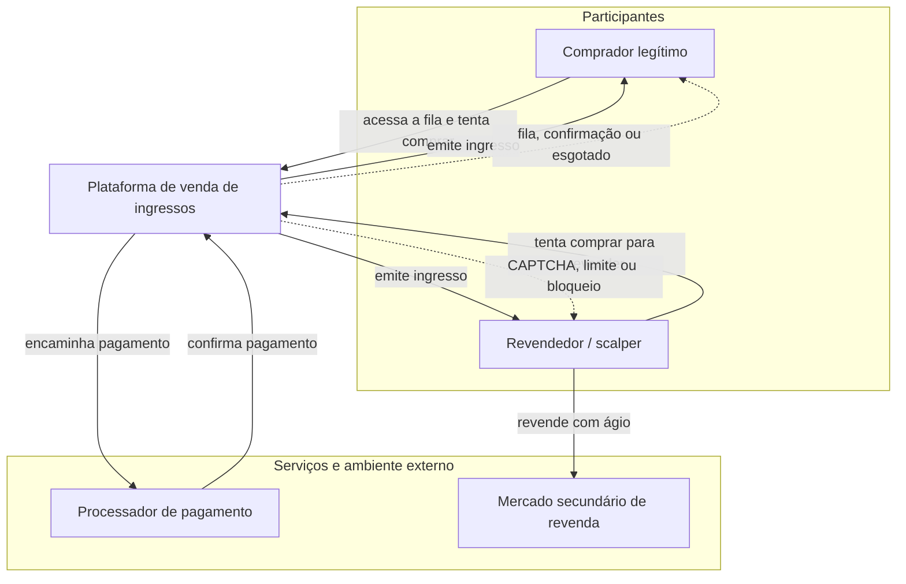

# Trabalho 1 — Análise de um Sistema Adversarial

**Sistema analisado:** Venda de ingressos para eventos com estoque limitado (fila virtual de compra)

> Consulte também [`GUIA-DE-EXECUCAO.md`](GUIA-DE-EXECUCAO.md) para saber como o grupo deve dividir e executar as etapas restantes deste trabalho.

---

## 3.1 Descrição do sistema adversarial

### Sistema e interação analisada

O sistema escolhido é uma **plataforma de venda de ingressos online** (ex.: para um show com lotação limitada). A interação específica analisada é a **compra de ingressos durante a abertura das vendas gerais**, quando a demanda supera a oferta e os compradores entram em uma fila virtual até que o estoque se esgote.

Não será analisado o domínio "venda de ingressos" como um todo (emissão, reembolso, check-in no evento, etc.), apenas o recorte: **do momento em que a venda abre até o estoque se esgotar ou o comprador concluir a compra**.

**Por que este recorte atende aos critérios do enunciado (item 2):**

| Requisito | Como é atendido |
|---|---|
| Pelo menos dois participantes que tomam decisões | Comprador legítimo, revendedor/scalper (operando com bots) e a plataforma (defensor) |
| Objetivos total ou parcialmente conflitantes | Scalper quer maximizar a quantidade de ingressos adquiridos; comprador legítimo quer garantir 1 ingresso ao preço de tabela; plataforma quer distribuir de forma justa e manter disponibilidade |
| Regra, métrica ou decisão explorável | Limite de ingressos por CPF/conta e posição na fila virtual podem ser contornados com múltiplas contas/bots |
| Resposta observável que permite reação/adaptação | Mensagens de fila, CAPTCHA, bloqueio de conta/IP, esgotamento de estoque são observáveis pelos atores |
| Escopo pequeno, implementável no Trabalho 2 | É viável simular: fila de pedidos, limite por conta, emissão de CAPTCHA/rate limit e checagem de CPF duplicado, sem precisar de uma plataforma completa |

### Atores, objetivos, ações e restrições

| Ator | Objetivo | Ações ou capacidades | Informações observáveis | Restrições ou custos |
|---|---|---|---|---|
| **Comprador legítimo** | Garantir 1 (ou poucos) ingresso(s) ao preço de tabela, para uso próprio, com o mínimo de esforço/atrito | Acessar o site/app no horário de abertura; aguardar na fila virtual; resolver CAPTCHA; preencher dados de pagamento; tentar novamente em caso de falha | Sua posição na fila; mensagens de erro ou "esgotado"; se o checkout foi concluído | Tempo disponível limitado; apenas 1 dispositivo/conexão; pouca ou nenhuma habilidade técnica para automação |
| **Revendedor / Scalper** | Adquirir o maior número possível de ingressos no menor tempo, para revender com ágio no mercado secundário | Criar múltiplas contas; usar bots/scripts para automatizar requisições; usar proxies/IPs rotativos; usar CPFs de terceiros ("laranjas") para contornar o limite por CPF; revender no mercado secundário | Taxa de sucesso das próprias tentativas; quais contas foram bloqueadas; tempo de resposta do sistema sob diferentes padrões de requisição | Custo de manter infraestrutura de bots/proxies; custo de obter CPFs/contas válidas; risco de banimento; risco de o mercado de revenda ser monitorado/banido |
| **Plataforma (defensor)** | Vender todo o estoque respeitando o limite por comprador, preservando a percepção de justiça e a disponibilidade, com baixo custo operacional | Implementar fila virtual (token de posição); aplicar limite por CPF/conta; exigir CAPTCHA; aplicar rate limiting por IP/dispositivo; detectar padrões automatizados (velocidade, repetição, user-agent); bloquear contas suspeitas; auditar vendas pós-evento | Padrões de requisição (velocidade, repetição de IP/dispositivo/cartão); taxa de conversão por conta; denúncias de usuários; ingressos reaparecendo no mercado secundário logo após a venda | Custo computacional da detecção; risco de falso positivo (bloquear comprador legítimo); custo de reputação se a venda for percebida como injusta; eventuais restrições legais sobre revenda de ingressos |

### Diagrama de contexto

Fonte editável: [`diagramas/contexto.mmd`](diagramas/contexto.mmd), acompanhada da
imagem [`diagramas/contexto.png`](diagramas/contexto.png).

Imagem exportada: [`diagramas/contexto.png`](diagramas/contexto.png).

### Pressupostos dos quais o sistema depende (e como podem falhar)

1. **"1 CPF = 1 pessoa física comprando para si mesma."** Esse pressuposto falha quando CPFs de terceiros são obtidos (comprados, alugados ou vazados) e usados para abrir contas em nome de outras pessoas, permitindo que um único scalper controle, na prática, dezenas de "identidades" válidas perante o limite por CPF.
2. **"Comportamento automatizado é distinguível de comportamento humano pelos padrões observados"** (velocidade de cliques, intervalo entre requisições, user-agent, etc.). Esse pressuposto falha quando os bots simulam variação humana (tempos aleatórios, movimento de mouse sintético) ou quando o scalper substitui bots por **fazendas de cliques** (pessoas reais operando em escala), que produzem padrões indistinguíveis de usuários legítimos.
3. **"O custo de burlar o sistema é maior do que o ganho esperado com a revenda."** Esse pressuposto falha quando o ágio no mercado secundário é alto o suficiente (evento muito procurado) para compensar o custo de manter contas, CPFs e infraestrutura de automação.

### Por que este é um caso adversarial, e não apenas um erro ou acidente

Um erro ou acidente é um evento não-intencional, que não responde a incentivos e não se adapta a contramedidas (ex.: uma falha de rede). Já neste caso:

- o scalper age **intencionalmente** para contornar uma regra (o limite por CPF/conta) em busca de benefício econômico;
- o scalper **observa** as respostas do sistema (bloqueios, CAPTCHAs, falhas de compra) e **adapta** sua estratégia (trocar de IP, usar outro CPF, ajustar a velocidade das requisições) para continuar obtendo ingressos;
- a plataforma, por sua vez, também observa o comportamento do scalper e adapta suas regras de detecção;
- existe um **conflito de objetivos** direto: o estoque é finito, então cada ingresso adquirido pelo scalper é um ingresso a menos disponível para um comprador legítimo.

Essa dinâmica de ação–observação–adaptação por ambos os lados, movida por incentivo econômico, é o que caracteriza o caso como adversarial (será aprofundado no modelo dinâmico, seção 3.3).

---

## 3.2 Modelo estratégico estático

_Pendente — ver [`GUIA-DE-EXECUCAO.md`](GUIA-DE-EXECUCAO.md), Etapa 3._

## 3.3 Modelo estratégico dinâmico

_A descrição das rodadas será consolidada pelo integrante responsável pelo modelo dinâmico._

O diagrama editável do ciclo adaptativo já está em
[`diagramas/ciclo-adaptativo.mmd`](diagramas/ciclo-adaptativo.mmd), com a respectiva
imagem em [`diagramas/ciclo-adaptativo.png`](diagramas/ciclo-adaptativo.png).

## 3.4 Ameaças e riscos

### Superfície de ataque

A superfície de ataque está concentrada nas interfaces que controlam a entrada na
fila, a identificação do comprador, a reserva temporária e as defesas que geram
respostas observáveis. O objetivo desta análise é compreender os pontos de
exploração do modelo, sem realizar testes invasivos em sistemas reais.

Fonte editável: [`diagramas/superficie-de-ataque.mmd`](diagramas/superficie-de-ataque.mmd).

| ID | Ponto de exploração | Elemento envolvido | Fraqueza ou pressuposto relacionado |
|---|---|---|---|
| E1 | Controle de entrada e requisições na fila | Fila virtual, token e endpoint de compra | O controle de velocidade e de repetição pode ser insuficiente ou previsível. |
| E2 | Validação de identidade e limite de compra | Conta, CPF e regra de quantidade | Um CPF ou uma conta podem ser tratados como uma pessoa única sem garantir que o controle esteja ligado ao comprador real. |
| E3 | CAPTCHA e sinais comportamentais | CAPTCHA, rate limit e bloqueios | O comportamento automatizado pode ser disfarçado ou confundido com o de usuários legítimos. |
| E4 | Reserva temporária e estoque | Checkout, janela de pagamento e emissão | A reserva pode concentrar ingressos ou manter estoque indisponível durante tentativas automatizadas. |

### Cenários de ameaça

Os cenários abaixo são derivados dos atores e pressupostos apresentados na seção
3.1. O scalper mantém o objetivo de obter ingressos para revenda, mas adapta a
ação conforme a resposta observada da plataforma.

**A1 — concentração de ingressos por identidades múltiplas.** Um revendedor pode
realizar várias compras por meio da validação de conta e CPF, aproveitando o
pressuposto de que um CPF corresponde a uma única pessoa comprando para si,
causando concentração do estoque e redução da justiça na distribuição sobre os
compradores legítimos.

**A2 — degradação da fila por automação.** Um revendedor pode realizar tentativas
repetidas por meio do controle de entrada da fila e das requisições de compra,
aproveitando controles de velocidade insuficientes ou previsíveis, causando
degradação da disponibilidade e aumento do tempo de espera para usuários
legítimos.

**A3 — contorno de desafio comportamental.** Um revendedor pode manter tentativas
automatizadas por meio do CAPTCHA e da análise de comportamento, aproveitando o
pressuposto de que padrões humanos e automatizados são sempre distinguíveis,
causando compras indevidas, falsos negativos e perda de confiança no processo.

| ID | Cenário de ameaça | Ponto de exploração | Pressuposto ou fraqueza | Ativo afetado | Probabilidade | Impacto | Risco |
|---|---|---|---|---|---:|---:|---:|
| A1 | Concentração de ingressos por identidades múltiplas | E2 — conta, CPF e limite | Identidade cadastral representa uma pessoa real e única | Justiça e distribuição correta | 3 | 3 | **9** |
| A2 | Degradação da fila por automação | E1 — fila e requisições | Rate limit insuficiente ou previsível | Disponibilidade e acesso legítimo | 3 | 2 | **6** |
| A3 | Contorno de desafio comportamental | E3 — CAPTCHA e sinais | Padrões automatizados são distinguíveis dos humanos | Confiança e justiça | 2 | 3 | **6** |

O risco prioritário é **A1**, pois combina probabilidade e impacto altos: o limite
por CPF pode aparentar estar funcionando enquanto um mesmo operador concentra
compras por meio de várias identidades.

### Resposta à ameaça prioritária e risco residual

Uma resposta possível é combinar o limite por CPF com sinais adicionais de
consistência da transação, como conta, meio de pagamento, dispositivo e histórico
de tentativas, aplicando revisão ou retenção temporária apenas quando houver
evidências suficientes. A plataforma deve coletar o mínimo necessário, proteger
esses dados e prever tratamento para falsos positivos.

Essa resposta revela ao adversário quais padrões acionam desafios, retenções ou
bloqueios. Na rodada seguinte, ele pode modificar o ritmo das tentativas, trocar
identidades ou distribuir as ações para tentar parecer um conjunto de compradores
independentes. A defesa, portanto, não elimina o conflito: ela altera os custos e
as informações disponíveis para os dois lados.

Os efeitos colaterais possíveis incluem CAPTCHA adicional, atraso no checkout,
bloqueio de compradores que compartilham rede ou dispositivo e exigência de mais
dados pessoais. O risco residual permanece porque identidades podem ser
compartilhadas, sinais podem gerar falsos positivos e a revenda no mercado
secundário continua existindo. Mesmo após a resposta, o sistema precisa preservar
justiça na distribuição, disponibilidade para usuários legítimos, privacidade e
transparência suficiente para que os bloqueios possam ser contestados.

## Declaração de uso de IA

_Pendente — ver [`GUIA-DE-EXECUCAO.md`](GUIA-DE-EXECUCAO.md), Etapa 6._

## Referências

Ver [`fontes/referencias.md`](fontes/referencias.md).

## Contribuições individuais

_Pendente — a ser preenchido conforme o histórico de commits do grupo (ver [`GUIA-DE-EXECUCAO.md`](GUIA-DE-EXECUCAO.md))._
